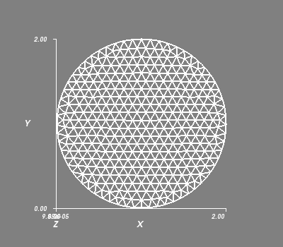
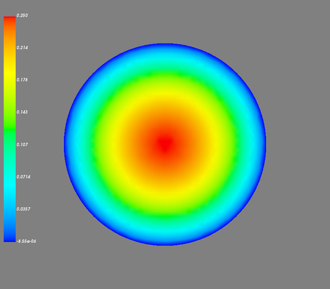
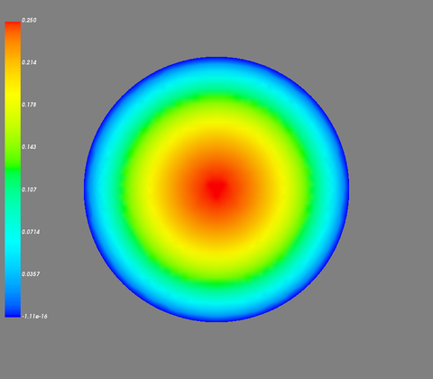
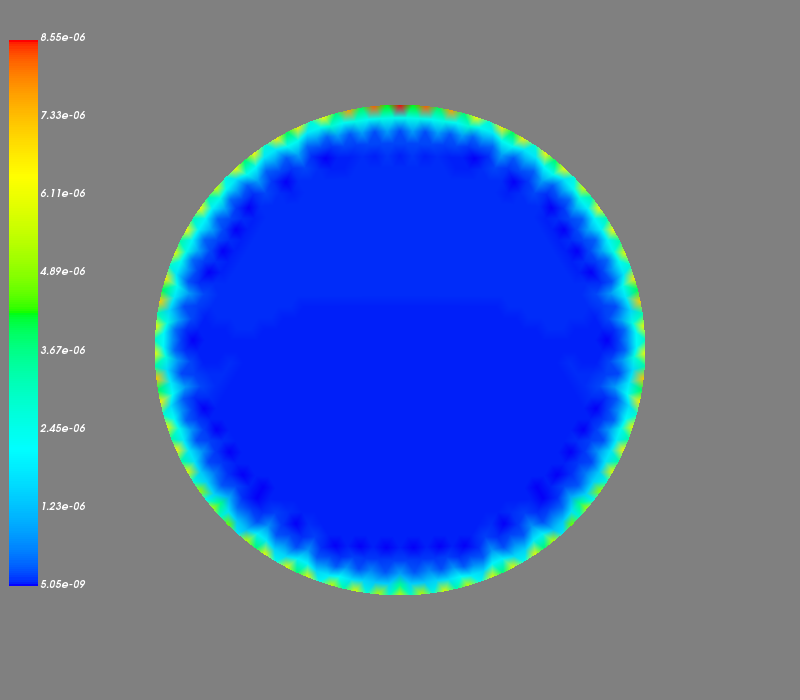

---
### @size[1.5em](Introduction to FEM Analysis with Python)

[@tkoyama010](https://twitter.com/tkoyama010)

+++

### Who are you? 👀

- @tkoyama010: [Twitter](https://twitter.com/tkoyama010), [Booth](https://tkoyama010.booth.pm/)
- Fortran, Python, C++, VBScript etc
- Simulation in Earthquake Engineering

+++

### Who are you? 👀

- Since last year, I have been distributing translated books of [GetFEM++](https://ja.wikipedia.org/wiki/GetFEM%2B%2B) in the event technical book of [techbookfest](https://techbookfest.org/).
- 😝I'm a GetFEM + + committer, but I've been earning commits for odd jobs. (Fix types, refactoring, translation tasks, etc.)
- I have recently started to add objects because I understand the internal structure quite well.
  - lumped mass brick object
  - Houbolt method objects
- 😤[contributing status](https://github.com/tkoyama010/getfem/graphs/contributors) my first goal is 100 commits.

+++

@snap[midpoint text-left]
### Agenda

✅ Overview

✅ Installation

✅ Example

✅ About Mayavi

✅ Summary

@snapend

+++

### 📝 Question❗

✋ I KNOW "partial differential equations (PDE)"

✋ I KNOW "finite element method (FEM)"

+++

@snap[midpoint text-left]
### 🤔 What is PDE and FEM❓

❗ PDE is a equation using in physics, engineering, and many other disciplines. FEM is a method of solving PDE.
@snap[midpoint text-left]


+++

### 👨‍💻What is GetFEM++?

- This library provides a framework for solving the finite element method, one of the methods for solving differential equations.
- FEM is a method of solving differential equations.


+++

### Release Notes

[Release Notes Version 5.3](http://getfem.org/whatsnew/5.3.html) @2018/06/22

[Release Notes Version 5.2](http://getfem.org/whatsnew/5.2.html) @2017/06/30

[Release Notes Version 5.1](http://getfem.org/whatsnew/5.1.html) @2016/08/18

[Release Notes Version 5.0](http://getfem.org/whatsnew/5.0.html) @2015/07/29

[Release Notes Version 4.3](http://getfem.org/whatsnew/4.3.html) @2014/07/14

- Development has been underway since the 1990s.
- Source code is refactored while maintaining backward compatibility.
- The current development version supports C + + 14.

+++

### Installation Instructions@Ubuntu

```bash
sudo apt install python-getfem++
```

- THAT'S ALL!!
- This is the end of the story and we don't know what's inside... so I get the source code with wget.

```bash
wget http://download-mirror.savannah.gnu.org/releases/getfem/stable/
getfem-5.3.tar.gz
```

+++

### Installation Instructions@Ubuntu

- Run the usual commands in the unzipped folder:.
```bash
./configure
```

- --with-pic : options for 64 bit compilation
- --enable-python3=yes : Option to use python3 instead of python2

+++

### Libraries Used

- [QD](https://bitbucket.org/njet/qd-library/src/master/) It says don't worry because only certain people use it. You can compile without it. What library, what...
- [Qhull](http://www.qhull.org/) A library used to compute the structure of convexs. This allows for mesh generation.


+++

### Libraries Used

- [MUMPS](http://mumps.enseeiht.fr/) Library for computing large sparse matrices. Used for parallel calculation.
- [LAPACK/BLAS](http://www.netlib.org/lapack/) Numerical Analysis Software Library for Linear Computing
- [Numpy/Scipy](https://www.scipy.org/) Numerical computation extension for Python

- Once these libraries are installed, a compile test and installation is performed with the following command:.
```bash
make && make check && sudo make install
```

+++


+++

### Topic

- Problem of [MathWork](https://jp.mathworks.com/help/pde/ug/solve-poissons-equation-on-a-unit-disk.html)
$$−\Delta u=1 \ {\rm on}\  \Omega, u=0 \ {\rm on}\  \delta \Omega $$


+++

### Mesher Object

- Creates the geometry by Mesher object .
```python
import getfem as gf
mo = gf.MesherObject('ball', [1.0, 1.0], 1.0)
```


+++

### Mesh object

- Creates a mesh object based on the geometry information of the Mesher object.
```python
# Approximate mesh length
h = 0.1
# Create Mesh Objects with second order elements
mesh = gf.Mesh('generate', mo, h, 2)
```



+++

### Move and Region Mesh

- Moves the center position of the mesh to (0.0, 0.0).
```python
mesh.translate([-1.0, -1.0])
```
- You will also set up an area for setting boundary conditions later.
```python
fb = mesh.outer_faces()
OUTER_BOUND = 1
mesh.set_region(OUTER_BOUND, fb)
```


+++

### Creating a MeshFem Object

- Create the object MeshFEM to assign the finite element method to the mesh. The node has 1 degree of freedom.
```python
mfu = gf.MeshFem(mesh, 1)
```
- This time use the normal [Lagrange Element](http://getfem.org/userdoc/appendixA.html#classical-lagrange-elements-on-simplices). The element order is be 2.
```python
elements_degree = 2
mfu.set_classical_fem(elements_degree)
```

+++

### Model object

- Create a [Model Object](http://getfem.org/userdoc/model_object.html) to solve problems with simultaneous equations.
```python
md = gf.Model('real')
```
- Add the variable 'u' using the MeshFem object.
```python
md.add_fem_variable('u', mfu)
```

+++

### Laplacian_brick

- Creates a MeshIm object that assigns an integral method to the mesh.
```python
mim = gf.MeshIm(mesh, pow(elements_degree,2))
```
- Adds the left-hand term of a differential equation to a Model object.
$$−\Delta u=1 \ {\rm on}\  \Omega$$
```python
md.add_Laplacian_brick(mim, 'u')
```

+++

### Setting various conditions

- Sets the right-hand term of a differential equation to a Model object.
$$−\Delta u=1 \ {\rm on}\  \Omega$$
- The variable name should be 'F'.
```python
import numpy as np
md.add_fem_data('F', mfu)
md.add_source_term_brick(mim, 'u', 'F')
md.set_variable('F', np.repeat(1.0, mfu.nbdof()))
```
- Set the boundary condition $u = 0 $(Dirichlet condition).
```python
md.add_Dirichlet_condition_with_multipliers(
    mim, 'u', elements_degree - 1, OUTER_BOUND
)
```

+++

### Calculation of unknown variable 'u'

- Now that the Model object is complete, solve computes the unknown variable 'u'.
```python
md.solve()
U = md.variable('u')
vtkfilename = 'displacement.vtk'
mfu.export_to_vtk(vtkfilename, mfu, U, 'Displacement')
```

+++

### Calculation of unknown variable 'u'



+++

### theoretical solution
- The theoretical solution is given by.
$$u(x, y) = \dfrac{1-x^2-y^2}{4}$$
- The coordinates of each node are obtained by numpy.array and the theoretical solution is calculated.
```python
xy = mfu.basic_dof_nodes()
x = xy[0, :]
y = xy[1, :]
sol = (1-x*x-y*y)/4.0
vtkfilename = 'sol.vtk'
mfu.export_to_vtk(vtkfilename, mfu, sol, 'solution')
```

+++

### theoretical solution




+++

### Comparison between calculated results and theoretical solutions



+++

### Creating an Image with Mayavi

```python
from mayavi import mlab

filename = 'solutions.png'

mlab.init_notebook()
vtk_file_reader = mlab.pipeline.open(vtkfilename)
surface = mlab.pipeline.surface(vtk_file_reader)

mlab.scalarbar(orientation='vertical')
mlab.show()
mlab.savefig(filename, magnification=2)
mlab.clf()
```
- Then use the saved image to display the image on [JupyterNotebook](https://github.com/tkoyama010/techbookfest-getfem/blob/master/doc/sphinx/source/unit-disk.ipynb).

+++

### Summary

- I explained the finite element method.
- We have described the internal structure of GetFEM
- GetFEM++ and Mayavi documentation on Transifex [Translating](https://www.transifex.com/getfem-doc/). We welcome your cooperation.
- We plan to publish a translation of the GetFEM + + documentation in Technical Document 7.
- A translation of the Mayavi documentation is available at [Here](https://mayavi-ja.readthedocs.io/ja/latest/).
- Today's exercise was performed here on [JupyterNotebook](https://github.com/tkoyama010/techbookfest-getfem/blob/master/doc/sphinx/source/unit-disk.ipynb).

+++

### Thank you 🙇
